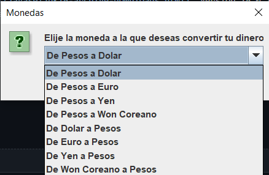
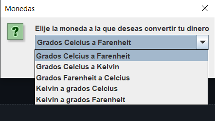

<h1 align="center"> Conversor de divisas </h1>
    
#### Conversor_Oracle Primer reto de la especialización de backend del programa ONE (Oracle Next Education)
    

 

    

    
## Table of Contents
1. [Descripcion](#descripcion)
3. [Dependencias](#dependencias)
4. [Autores](#autores)

***
### Descripcion

Es un conversor de divisas y temperatura creado con java. La conversion de divisas se realiza utilizando la version gratuita de <a href="https://www.exchangerate-api.com/" target="_blank"> ExchangeRate-API</a> para poder obtener los valores mas precisos de las divisas, mientras que la conversión de temperatura se realiza de forma estatica mediante formulas establecidas.

***
### Funcionalidades
* `Conversor de moneda`: El programa cuenta con diversas opciones para convertir las divisas

    

Al seleccionar una opcion, se realizaz una peticion a el <a href="https://www.exchangerate-api.com/" target="_blank"> ExchangeRate-API</a>, una vez obtenida la respuesta, el programa realiza la conversión y muestra los resultados de la operación.

* `Conversor de temperatura`: De igual forma, el programa cuenta con varias opciones para realizar la conversión de temperatura

    

Una vez seleccionada una, a diferencia de la funcion anterior, aquí el programa realiza el calculo con formulas establecidas de manera interna.

***
### Dependencias

* [JSON](https://mvnrepository.com/artifact/org.json/json/20220320): Version 20220320
* [JavaSE-18](https://www.oracle.com/java/technologies/javase/jdk18-archive-downloads.html): Version 18.0.2.1
* [Package javax.swing](https://docs.oracle.com/javase/8/docs/api/index.html?javax/swing/package-summary.html)

***
### Autores
[ Emmanuel Reyna Cruz](https://github.com/EmmanuelR0411)
