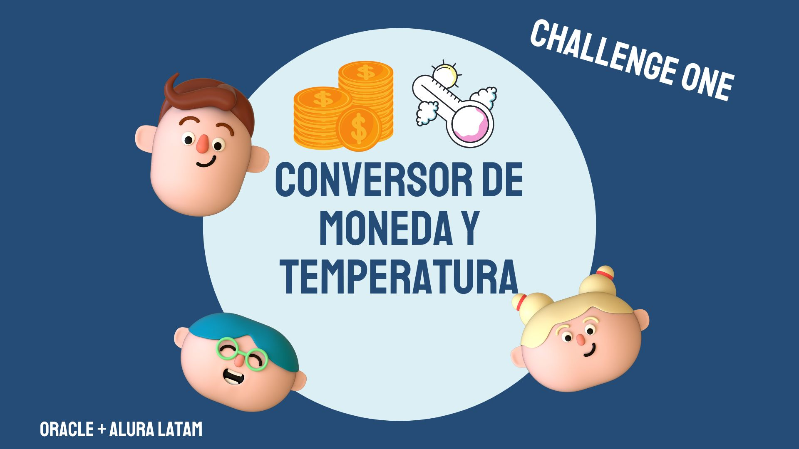

<h1 align="center"> Conversor de divisas </h1>
# Conversor_Oracle
Primer reto de la especialización de backend del programa ONE (Oracle Next Education)

 

*[Descripción del proyecto](#Conversor de monedas y de temperatura realizado con Java
El programa cuenta con dos funciones:
->Divisas: La primera funcion sirve para convertir el peso Mexicano en diversas divisas, como el euro, dolar, etc.
    )